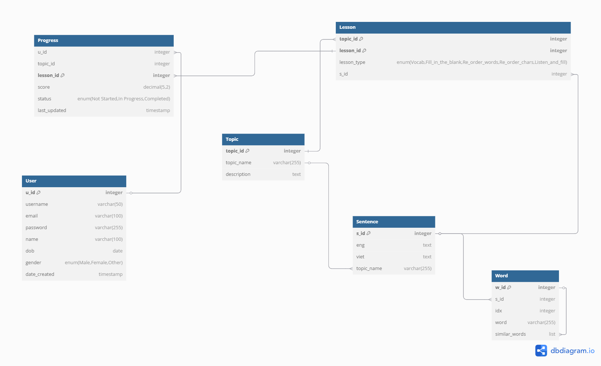

# Software Engineering Data

## Overview
This data is made for our SE project here: [Vietnamese Learning Website](https://github.com/Pearlcentt/Vietnamese_Learning_Web)


This data contains 10 tables: 
- User table: 
    - Store user details such as `u_id`, `username`, `email`, `password`, `name`, `dob`, `gender`, `date_created`.
- Topic table: 
    - Contains topics with `topic_id`, `topic_name`, and a `description`.
- Lesson table: 
    - Represents lessons with `lesson_id`, `topic_id`, and `title`.
- Progress table: 
    - Tracks user progress for lessons, including `score`, `status`, and `last_updated`.
- Question table: 
    - Stores questions related to lessons, with `q_id`, `w_id` (linked to words), `s_id` (linked to sentences), `q_type` (question type), and `idx` (variation index).
- Lesson_Question table: 
    - Links lessons and questions, storing `lesson_id`, `q_id`, and `question_text`.
- Word table: 
    - Contains words with `w_id`, `eng` (English), `viet` (Vietnamese), and `synonyms`.
- Media table: 
    - Stores media URLs for lessons with `media_id`, `eng_url`, and `viet_url`.
- Sentence table: 
    - Holds sentences in both languages with `s_id`, `eng` (English), `viet` (Vietnamese), and `topic_name`.
- Sentence_Token table: 
    - reaks down sentences into tokens, with `token_id`, `s_id`, `language`, and `token`.


## Usage
1. Clone the repository:
    ```sh
    git clone https://github.com/fisherman611/se-data.git
    ```
2. Navigate to the project directory:
    ```sh
    cd se-data
    ```
## Contributing

Contributions are welcome! Please feel free to submit a pull request or open an issue to discuss any changes or improvements.
